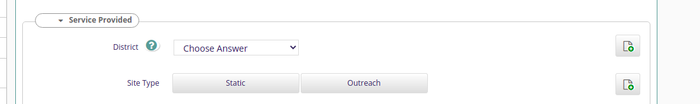

##PSI-Analytics
###Project to sync data from OpenMrs to DHIS2

####Setting up analytics DB

1. Create a postgres container.
2. Create analytics db. 
   ~~~
    create database analytics;
    create user analytics with password 'password';
    grant all privileges on database analytics to analytics;
   ~~~
3. Run the run_liquibase.sh script in resources > liquibase > scripts

####Setting up Openmrs DB
1. Create a mysql container.
2. import the openmrs DB downloaded from [here](http://206.189.138.201/psi_openmrs.sql.gz). 
3. Copy and run the functions in sql_functions.sql.

####Running the application
Run PsiAnalyticsApplication.java

##Buildeing the RPM
1. Build the application using `mvn clean install`
2. Run `./gradlew -PpsiRelease=0.1 :psi-analytics:clean :psi-analytics:buildRpm` from the project root directory.
(The release version can be passed in properly)
The rpm file will be created in `psi-analytics/build/distributions` folder.

---

###Overview
This project is used for flattening the hierarchical tables in openMRS(mysql DB) to an analytics DB(postgres).
 We will be flattening data from `patient` (and related tables like person, person_address, person_attributes etc.),
`obs` and `program_enrollment` tables in openmrs database to analytics DB. The data from the analytics DB will be used for syncing to DHIS2.

####Program Flow
Whenever we perform operations in Bahmni related to adding a new patient, program enrollment or creating an encounter,
an event record will be created in the `event_records` table in OpenMRS DB. The `category` column contains the category of the event, 
eg patient, encounter etc, and the `object` column contains the uuid reference of the column in the respected table. 

When we start the application, the JobScheduler gets triggered. It picks up cron jobs for Patient, Enrollment and Encounter from the analytics_cron_job table in analytics db and starts them.
It picks up a `FlatteningTask` bean with the name specified in the cronJob settings. We have three implementations for this FlatteningTask interface, `PatientTask`, `EncounterEventBasedJob` and `ProgramEnrollmentTask` for the flattening of patient, encounter and enrollment respectively.
The readers read the EventRecords, then get the corresponding object we need to flatten using the uuid from the `object` column, and send them to
the processors for processing (Our processor classes doesn't do much currently, they just pass the data to the writer). The writer classes do most 
of the processing. Writers generate the insert queries with the data values received from processors and insert them into the respective tables in analytics DB.
####DB Access
We will be using jdbc templates for querying the DB. The datasources and jdbcTemplates are defined in DataSourceConfig.
There are two datasources, one for the openmrs (mySql) DB which we will be reading from and one for analytics(postgres) DB,
which we will be writing to.

####Batch jobs
We will have batch jobs for processing `Patients`, `Encounters` and `Program Enrolments`. The reader, writer, processor and related classes for these are present in jobs package.

 ####Handling MultiSelect inputs
 We will be creating a binary column for each of the values of the field. For the selected options we will set 'true' to 
indicate they have been selected.
 
###Patient Flattening
All patient related data including patient name, UIC and other attributes in openmrs db are flattened to a patient table in analytics db. This data will be used to create or update the Tracked Entity Instance for the patient in DHIS2.
We will be using the Patient mapping entered from the mapping utility to map the columns in patient table to DHIS data elements.

###Program Enrolment Flattening
When a patient is enrolled to a bahmni program, corresponding entry will be added in the `patient_program` table in openmrs db. We will be flattening these details to `program_enrolment` table in analytics.
The flattened data will be used for creating an enrolment for the TrackedEntity. Since currently DHIS2 only has one program (i.e ZW - New Start EMR) and all other Bahmni Programs, like ART, HTS, TB etc. are configured as Program Stages of the ZW - New Start EMR program,
we will be creating only one enrolment for a TrackedEntityInstance to  ZW - New Start EMR, even if a patient has multiple program enrolments. The enrolmentDate for the DHIS enrolment crated will be the date of the oldest Bahmni Program enrolment for the patient.

###Encounter
The encounter details entered into the `encounter` table in openmrs will be flattened to a corresponding `encounter` table in analytics. This will contain the encounter_id, patient_id, encounter_date etc.
If we have entered any form details in the encounter for which we have already added the mappings from the mapping utility, then the form data will be flattened to a corresponding form table in the analytics db. 
The data entered for the forms will be read from the `obs` table in openmrs.

In case there are any issues while flattening, for eg: if the table has not been created for the form, new concepts are added to the form(i.e form is updated), the flattening process will stop. It will continue only after the specified commands mentioned in the error message are run using the CLI util.

 ####Important Notes :
 1. Handling Multiselect Columns in Forms.
    DHIS does not support multiselect fields. Instead, for each of the multiselect options, we will create boolean fields. If the multiselect option is selected in bahmni form, the corresponding DHIS element will have value true.
 2. Column Naming Convention.
    To keep the column names in the table unique, we abbreviate all the parent sections of a field and then append it to the field name. For example, for a field `Site Type` inside section `Service Provided` will be named, sp_site_type.
 
    
 
**Even if we are adding the section abbreviations to the columns, there are chances that some columns will still have the same name. If such a situation arises, there will be an error when we try to create or update the form table using the CLI.**
**This can not be handled automatically by the program, and the only workaround would be to manually rename the concepts for the fields in such a way that they are unique.**
 
 3. Adding and removing fields from the form are supported by the program, but renaming an already created field will cause issues, as the corresponding column name will not be automatically updated.
    Verify thoroughly that the added concepts does not contain any spelling mistakes and will not be requiring future changes, before publishing. In the extreme case we need to rename the field, we would have to manually rename the column in the corresponding table using an `alter table` query.
 4. We will be using Facility and District concept classes to identify the fields in the forms. While adding new Facility or District concepts, set its concept class properly as Facility or District.

###Forms used in each program
| Health Area | Forms in Bahmni                                                                                                       |
|-------------|-----------------------------------------------------------------------------------------------------------------------|
| ART         | Art initial Visit compulsory Question 1 of 2  Art initial Visit compulsory Question 2 of 2  Assessment and Plan |
| PrEP        | PrEP Screening Tool  PrEP Initial  PrEP Continuation                                                            |
| FP          | FP Counselling Only  Family Planning Initial  FP Continuation                                                   |
| HTS         | Provider HIV test counselling  HIV Self testing                                                                 |
| TB          | TB Screening and History                                                                                              |
| NCD         | NCD Template                                                                                                          |
| STI         | STI Symptoms                                                                                                          |
| VIAC        | VIAC Form Template                                                                                                    |
| Referrals   | Referrals template                                                                                                    |
| IPV         | IPV form                                                                                                              |
